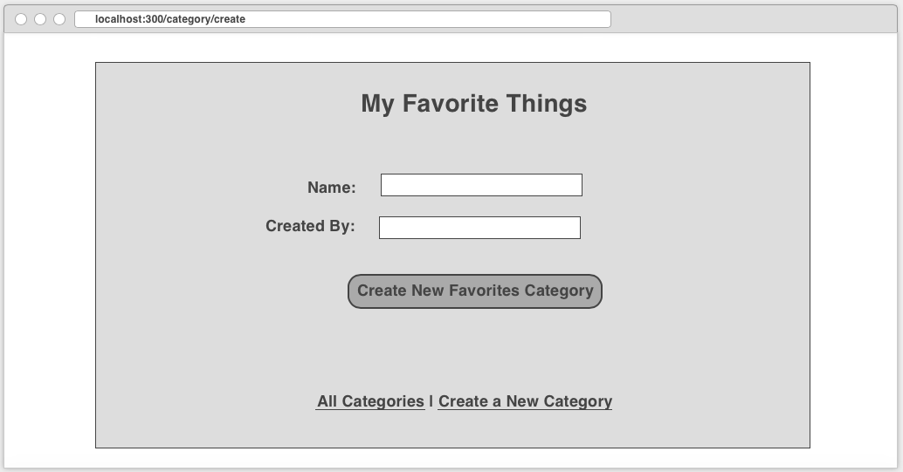
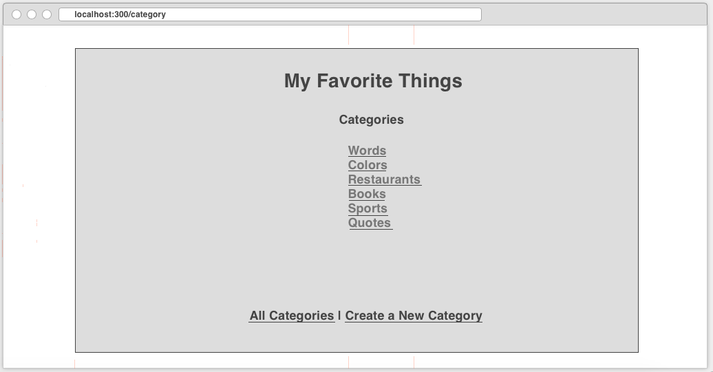
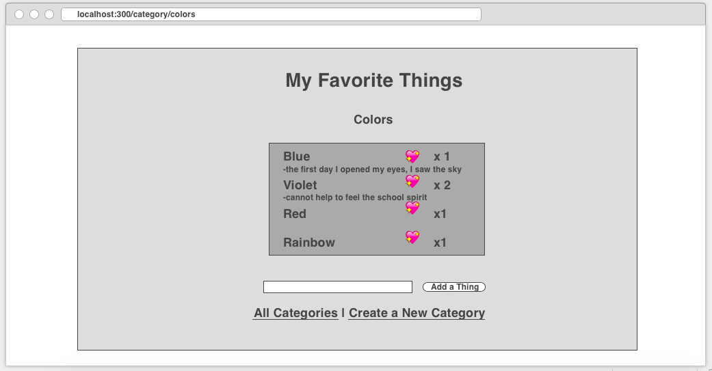
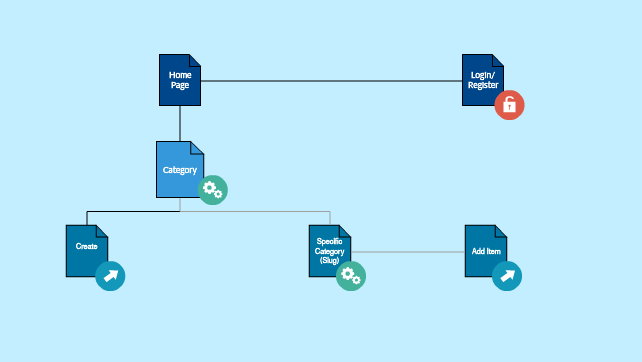

#Daydreamer's Book

## Overview
It has become really hard to not be deprived of sleep. It has become harder to not forget our dreams.
Whether it is dreams at night or in the day, the chances they become true will increase when we remember them.

Daydreamer's Book is a web app that allows daydreamers to write a book about their dreams! Users can register and login. After they are logged in, they can create or view tabs or sections, grouped according to the user's liking. For every tab they have, they can add or delete a customized page which includes a name/title, a quantity that they can update to represent the number of times they feel a strong love towards the dream, and an optional description of all the details and special feelings.


## Data Model
First draft schema:
```javascript
// users

// * our site requires authentication...

// * so users have a username and password

// * they also can have 0 or more lists

var User = new Schema({
    // username, password provided by plugin
    lists:  [{ type: mongoose.Schema.Types.ObjectId, ref: 'Tab' }],
    username: String,
    password: String
});
// a page (or group of the same ideas under a topic) in a section
// * includes a name, a quantity of number of times loved, and an optional description/feeling/details that can be edited
var Page = new Schema({
    name: {type: String, required: true},
    numsLiked: {type: Number, default:0, required: false},
    //numsLiked: {type: Number, min: 1, required: false},
    description:{type: String, required: false}
}, {
    _id: true
});

// a tab of ideas/'dreams'
// * each tab must have a related user
// * a tab can include 0 or more pages
var Tab = new Schema({
    user: {type: mongoose.Schema.Types.ObjectId, ref:'User'},
    name: {type: String, required: true},
    totalLikes: {type: Number, default:0},
    createdAt: {type: Date, default: Date.now},
    pages: [Page]
}, {
    _id: true
});
```


## Wireframes
/category/create - page for creating a new favorites category



/category - page for showing all favorite categories



/category/slug - page for showing a specific category




## Site map




## User Story
1. as a user, I can create a new favorites category
2. as a user, I can view all of the favorites categories I've created in a single list
3. as a user, I can add items to an existing favorites category
4. as a user, I can change the number of times I uncontrollably like items in an existing favorites category


## Research Topics
* (6 points) Integrate user authentication
    * I'm going to be using Passport.js for user authentication
    * implement sign up and registration 
    * And account has been made for testing; I'll email you the password
* (4 points) Perform client side form validation using custom JavaScript or JavaScript library
    * errors must be integrated into the DOM


